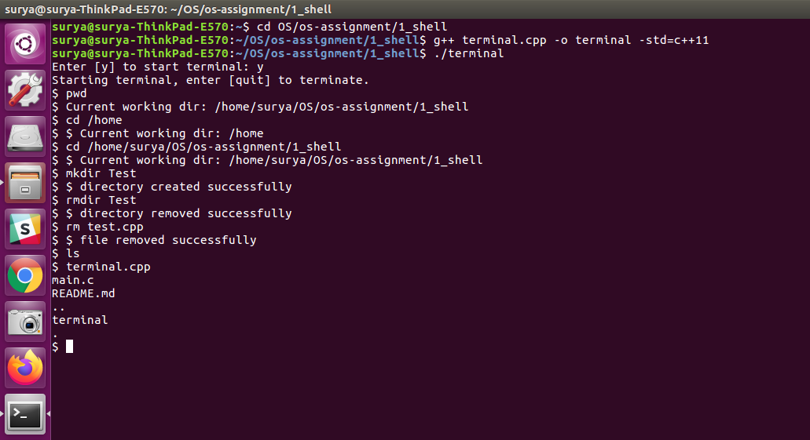

# Shell assignment question

## Task:
Write a C program to implement the command line​ ​ shell

## Commands supported:
1. pwd
2. ld
3. mkdir
4. rmdir
5. rm
6. cd

## Running instructions:
C++11 or greater should be used to execute this program.
Command to compile and run the program:

```
g++ terminal.cpp -o terminal -std=c++11 && ./terminal
```
The terminal will open and the instructions ensuing will guide the user.

## Sample output:

The following is the image of the code working in Ubuntu terminal - 

