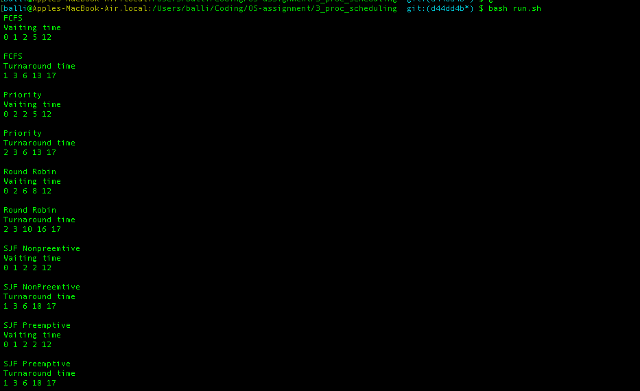
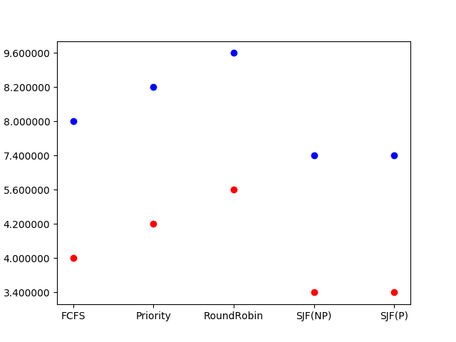

# Q3 Scheduling Algorithms

## Task
Implement scheduling algorithms.

## Features
1. Reads the processes from an input txt file, `processes.txt`
2. Runs all 5 algorithms in the main function
3. Generates a graph automatically that gives average waiting time and turnaround time.

## Run instructions
`bash run.sh`

> Note: `run.sh` must be executed from this folder. 

Creates `stats.png` containing graph of each algorithm's average waiting time and turnaround times.

## Outputs

