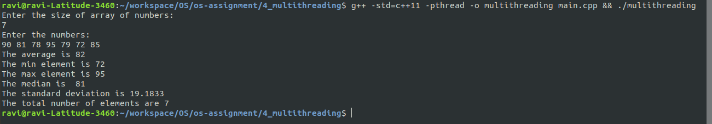

# Multithreading

## Task:
To write a C/C++ program to input an array of number and calculate different statistical measures on the numbers. Each statistical measure should be computed using its own thread and the values should be reported after all worker threads finish execution.

## Statistical features implemented:
1. Average (mean)
2. Minimum
3. Maximum
4. Median
5. Standard Deviation
6. Count of elements

## Running instructions:
The `thread` library in c++ requires the addition of `-pthread` flag during compilation. Additionally, the `thread` library was introduced to C++ from c++11. Hence, c++11 or greater should be used to execute this program.
Command to compile and run the program:

```
g++ -std=c++11 -pthread -o multithreading main.cpp && ./multithreading
```

To verify that each statistical feature is being computed using different threads, an extra parameter can be passed through the command line to print the worker PIDs. The flag `print_pids` should be passed while running the program as follows:

```
g++ -std=c++11 -pthread -o multithreading main.cpp && ./multithreading print_pids
```

## Sample outputs:
There are two outputs for the program. The first picture shows the computed statistical measures.  



To verify that the statistical measures were computed using different threads, the PID of each thread is printed before the thread completes execution.


